# Linking A Project to your xUnit tests

## Adding FluentAssertions as a NuGet Package

### Visual Studio

1. Open your Solution with Visual Studio (Or create a new project)

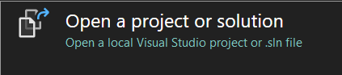

2. With your solution open, select `Project > Manage NuGet Packages`

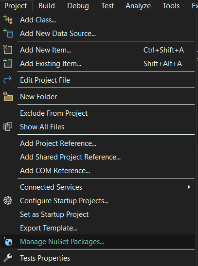

3. In the NuGet Package Manager, select the `Browse` tab, and search for `FluentAssertions`

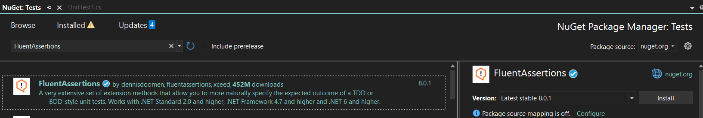

4. Select the desired `Version` of `FluentAssertions` and install it into your `xUnit Tests`

### Visual Studio Code

1. Ensure you have the `C# Dev` Extension kit installed.

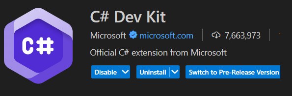

2. Open your `Command Palette` with `Ctrl + Shift + P`
3. In your `Command Palette`, search for `NuGet: Add NuGet Package...`

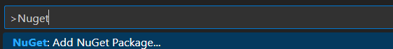

4. Select your `xUnit` project

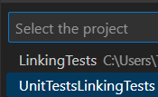

5. Search for `FluentAssertions` in the search bar

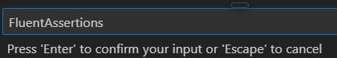

6. Select `FluentAssertions`

7. Select the correct `Version` you wish to install

## Adding your Projects as a Dependency

### Visual Studio

1. Right Click on your `Solution Explorer` and select `Add > Existing Project` 

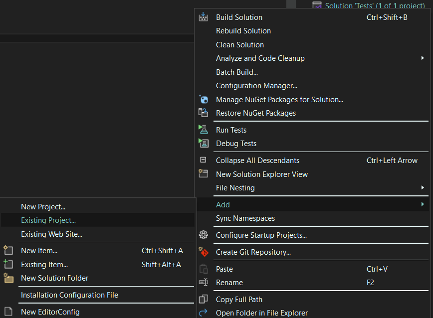

2. You will be prompted to select a `.csproj` file, locate your project's `.csproj` file and select it.
3. On your `xUnit` test project, right click and select `Add > Project Reference`

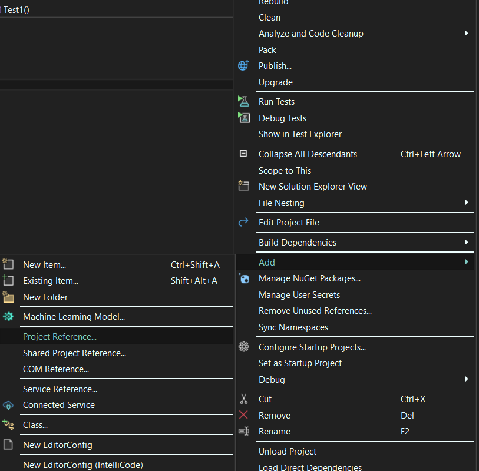

4. In the `Reference Manager`, select your Project, and click `OK`

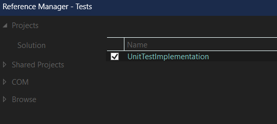

### Visual Studio Code
1. In your `Command Palette`, select `.NET: Add Existing Project...` or Right Click your `Solution` inside of your `Solution Explorer`

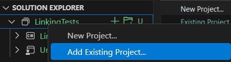

2. You will be prompted to select a `.csproj` file, locate your project's `.csproj` file and select it.

3. On you `xUnit` test project, right click and select `Add Project Reference`

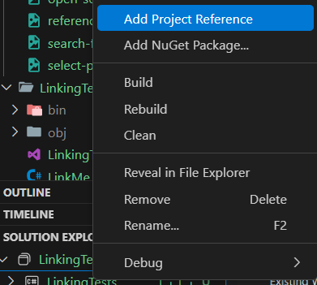

4. Select your Project in the `Command Palette`

## Testing your project

### Running your Tests in Visual Studio

1. Select `Test` and choose how to run your test

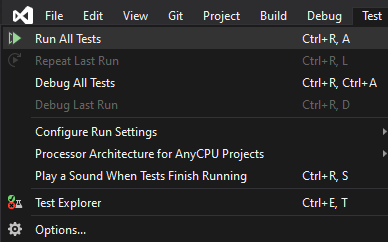

2. For more information, open your Test Explorer under `Test > Test Explorer` or with `Ctrl + E, T`

### Running your Tests in Visual Studio Code

1. Open your `Testing` Tab

2. Refresh your tests to make them show up by pressing the refresh button at the top of the `Testing` tab, or press `Ctrl + ;, Ctrl + R`
3. Run your tests with the run tests button at the top of the `Testing` tab, or press `Ctrl + ;, A` (You can debug them with the debug button or `Ctrl + ;, Ctrl + A`)
