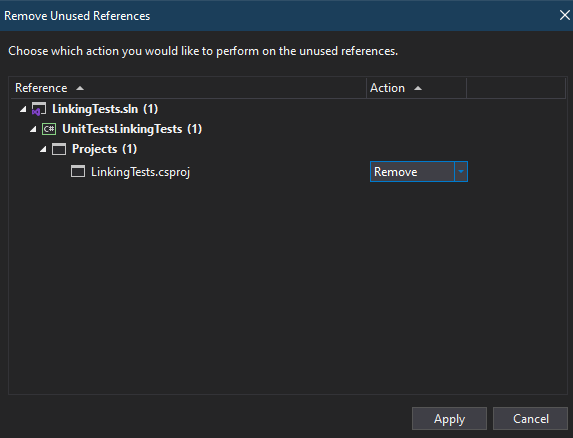

# Linking A Project to your xUnit tests

## Adding FluentAssertions as a NuGet Package

### Visual Studio

1. Open your Solution with Visual Studio (Or create a new project)


2. With your solution open, select `Project > Manage NuGet Packages`


3. In the NuGet Package Manager, select the `Browse` tab, and search for `FluentAssertions`


4. Select the desired `Version` of `FluentAssertions` and install it into your `xUnit Tests`

### Visual Studio Code

1. Ensure you have the `C# Dev` Extension kit installed.


2. Open your `Command Palette` with `Ctrl + Shift + P`
3. In your `Command Palette`, search for `NuGet: Add NuGet Package...`


4. Select your `xUnit` project


5. Search for `FluentAssertions` in the search bar


6. Select `FluentAssertions`

7. Select the correct `Version` you wish to install

## Adding your Projects as a Dependency

### Visual Studio

1. Right Click on your `Solution Explorer` and select `Add > Existing Project` 


2. You will be prompted to select a `.csproj` file, locate your project's `.csproj` file and select it.
3. On your `xUnit` test project, right click and select `Add > Project Reference`


4. In the `Reference Manager`, select your Project, and click `OK`


### Visual Studio Code
1. In your `Command Palette`, select `.NET: Add Existing Project...` or Right Click your `Solution` inside of your `Solution Explorer`


2. You will be prompted to select a `.csproj` file, locate your project's `.csproj` file and select it.

3. On you `xUnit` test project, right click and select `Add Project Reference`


4. Select your Project in the `Command Palette`

## Testing your project

### Running your Tests in Visual Studio

1. Select `Test` and choose how to run your test


2. For more information, open your Test Explorer under `Test > Test Explorer` or with `Ctrl + E, T`

### Running your Tests in Visual Studio Code

1. Open your `Testing` Tab


2. Refresh your tests to make them show up by pressing the refresh button at the top of the `Testing` tab, or press `Ctrl + ;, Ctrl + R`
3. Run your tests with the run tests button at the top of the `Testing` tab, or press `Ctrl + ;, A` (You can debug them with the debug button or `Ctrl + ;, Ctrl + A`)

## Common Errors

### Circular Dependencies

A circular dependency is when one or more files have each other as project references.

This can be solved by removing the unnecessary project dependencies (e.g. your non-test project having a dependency on your unit tests)

## Removing Project References

### Removing References in Visual Studio

1. In your `Solution Explorer`, Right Click on the project you wish to remove a reference from.
2. In the context menu, select `Remove Unused Dependencies`.
3. A menu should show up, allowing you to view which dependencies are unused, and will allow you to choose to keep or remove them. Once you have selected the dependencies you wish to remove, select `Apply`.



4. A prompt confirming this action should be presented, and will warn you that `You cannot undo this action`. Select `Yes` to remove the selected dependencies.

### Removing References in Visual Studio Code

1. Visual Studio Code does not include a reference manager, unlike Visual Studio. To remove a reference, open a new `Terminal` with ``Ctrl + Shift + ` ``
2. In your `Terminal`, use the [dotnet remove reference](https://learn.microsoft.com/en-us/dotnet/core/tools/dotnet-remove-reference) command to remove your reference

This command will remove a reference to the UnitTestsLinkingTests project from the LinkingTests project:

```cs
dotnet remove LinkingTests/LinkingTests.csproj reference UnitTestsLinkingTests/UnitTestsLinkingTests.csproj
```
